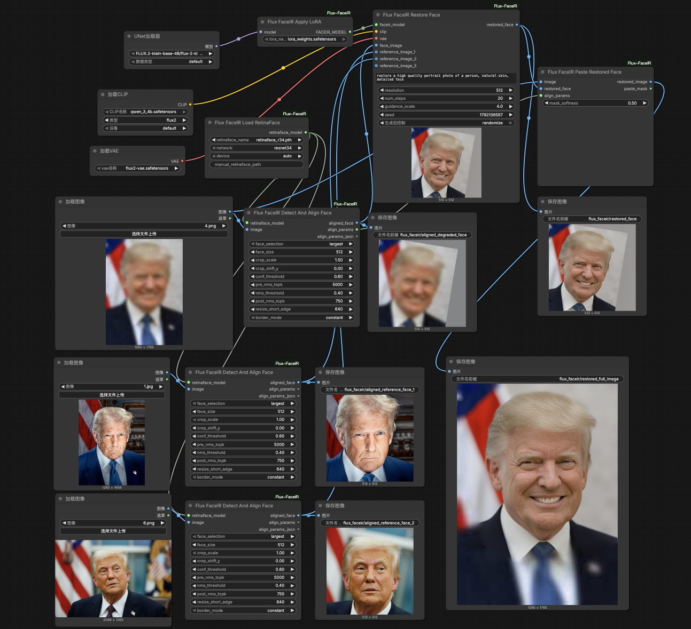

# ComfyUI Flux FaceIR

ComfyUI extension for FLUX FaceIR face restoration. It supports both:

- aligned face restoration from pre-cropped face patches
- full-image restoration from original images with face detection, alignment, parameter export, and paste-back

Main training/inference repository: [cosmicrealm/flux-restoration](https://github.com/cosmicrealm/flux-restoration)

## Workflows

This extension ships with two workflows:

- `workflows/aligned_face_restore.json`
- `workflows/full_image_restore.json`

`aligned_face_restore.json` is for already aligned face crops.

`full_image_restore.json` is the whole-image workflow:

1. load one degraded full image
2. load reference full images
3. detect and align faces with RetinaFace
4. restore the aligned degraded face with FaceIR
5. export alignment parameters
6. paste the restored face back to the original degraded image

The detect-and-align node returns both:

- `align_params`: structured affine/paste-back parameters for downstream nodes
- `align_params_json`: readable JSON text for debugging or export

## Screenshots

Aligned workflow:


Whole-image workflow:



## Installation

Copy this directory into `ComfyUI/custom_nodes`, then install dependencies:

```bash
cd ComfyUI/custom_nodes
cp -R /path/to/flux-restoration/release/ComfyUI-Flux-FaceIR ./ComfyUI-Flux-FaceIR
cd ComfyUI-Flux-FaceIR
python install.py
```

Restart ComfyUI after installation.

If you already have this repository locally, you only need to copy `release/ComfyUI-Flux-FaceIR` into `ComfyUI/custom_nodes`.

## Required Models

Recommended model layout:

```text
ComfyUI/models/
  diffusion_models/
    FLUX.2-klein-base-4B/
      flux-2-klein-base-4b.safetensors
  text_encoders/
    qwen_3_4b.safetensors
  vae/
    flux2-vae.safetensors
  loras/
    lora_weights.safetensors
  face_detectors/
    retinaface_r34.pth
```

Download links:

- FLUX base model:
  [`flux-2-klein-base-4b.safetensors`](https://huggingface.co/black-forest-labs/FLUX.2-klein-base-4B/resolve/main/flux-2-klein-base-4b.safetensors)
- Qwen text encoder:
  [`qwen_3_4b.safetensors`](https://huggingface.co/Comfy-Org/z_image_turbo/resolve/main/split_files/text_encoders/qwen_3_4b.safetensors)
- FLUX VAE:
  [`flux2-vae.safetensors`](https://huggingface.co/Comfy-Org/flux2-dev/resolve/main/split_files/vae/flux2-vae.safetensors)
- FaceIR LoRA:
  [`lora_weights.safetensors`](https://huggingface.co/zhangjinyang/flux-restoration/resolve/main/pretrained_models/lora_weights.safetensors)
- RetinaFace detector:
  [`retinaface_r34.pth`](https://github.com/yakhyo/retinaface-pytorch/releases/download/v0.0.1/retinaface_r34.pth)

Example download commands:

```bash
mkdir -p ComfyUI/models/face_detectors
wget -O ComfyUI/models/face_detectors/retinaface_r34.pth \
  https://github.com/yakhyo/retinaface-pytorch/releases/download/v0.0.1/retinaface_r34.pth
```

```bash
mkdir -p ComfyUI/models/loras
wget -O ComfyUI/models/loras/lora_weights.safetensors \
  https://huggingface.co/zhangjinyang/flux-restoration/resolve/main/pretrained_models/lora_weights.safetensors
```

## Node Overview

Core nodes:

- `Flux FaceIR Apply LoRA`
- `Flux FaceIR Load RetinaFace`
- `Flux FaceIR Detect And Align Face`
- `Flux FaceIR Restore Face`
- `Flux FaceIR Paste Restored Face`

Recommended graph:

1. Load base FLUX components with `UNETLoader`, `CLIPLoader`, and `VAELoader`.
2. Apply `lora_weights.safetensors` with `Flux FaceIR Apply LoRA`.
3. If your inputs are already aligned:
   use `Flux FaceIR Restore Face` directly.
4. If your inputs are full images:
   use `Flux FaceIR Load RetinaFace` -> `Flux FaceIR Detect And Align Face` -> `Flux FaceIR Restore Face` -> `Flux FaceIR Paste Restored Face`.

The bundled whole-image workflow is configured for:

- detector weights: `retinaface_r34.pth`

## Notes

- This extension does not download weights automatically.
- Base model loading follows standard ComfyUI loaders.
- The bundled workflow targets the non-quantized `flux-2-klein-base-4b.safetensors`, not the FP8 variant.
- `Flux FaceIR Restore Face` supports blind restoration and reference-guided restoration with up to three references.
- The full-image workflow only pastes the restored face back into the degraded source image. Reference images are used only for guidance.
- `crop_scale`, `crop_shift_y`, detector thresholds, and resize settings are exposed on the detect-and-align node, so you can widen the crop to include more forehead, chin, or shoulder context when needed.
