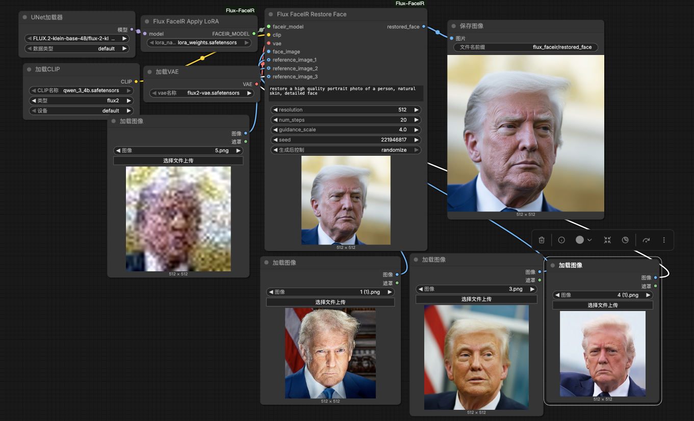

# ComfyUI Flux FaceIR

Main repository: [cosmicrealm/flux-restoration](https://github.com/cosmicrealm/flux-restoration)  

LoRA weights: [lora_weights.safetensors](https://huggingface.co/zhangjinyang/flux-restoration/blob/main/pretrained_models/lora_weights.safetensors)

Base DiT: [flux-2-klein-base-4b.safetensors](https://huggingface.co/black-forest-labs/FLUX.2-klein-base-4B/blob/main/flux-2-klein-base-4b.safetensors)  

Text encoder: [qwen_3_4b.safetensors](https://huggingface.co/Comfy-Org/z_image_turbo/resolve/main/split_files/text_encoders/qwen_3_4b.safetensors)  

VAE: [flux2-vae.safetensors](https://huggingface.co/Comfy-Org/flux2-dev/resolve/main/split_files/vae/flux2-vae.safetensors)



This extension packages the aligned-face restoration workflow from `flux-restoration` for ComfyUI. It is intended for already cropped/aligned face inputs, with optional `0~3` reference images.

## Installation

Copy this directory into `ComfyUI/custom_nodes`, then install dependencies:

```bash
cd ComfyUI/custom_nodes
cp -R /path/to/flux-restoration/release/ComfyUI-Flux-FaceIR ./ComfyUI-Flux-FaceIR
cd ComfyUI-Flux-FaceIR
python install.py
```

Restart ComfyUI after installation.

If you already have a local copy of this repository, the only file installation step is copying `release/ComfyUI-Flux-FaceIR` into `ComfyUI/custom_nodes`.

## Model Layout

Recommended ComfyUI model layout:

```text
ComfyUI/models/
  diffusion_models/
    FLUX.2-klein-base-4B/
      flux-2-klein-base-4b.safetensors
  text_encoders/
    qwen_3_4b.safetensors
  vae/
    flux2-vae.safetensors
  loras/
    lora_weights.safetensors
```

## Usage

This extension keeps one workflow:

- `workflows/aligned_face_restore.json`

Recommended graph:

1. Use ComfyUI official loaders:
   - `UNETLoader`
   - `CLIPLoader`
   - `VAELoader`
2. Use `Flux FaceIR Apply LoRA` to attach `lora_weights.safetensors`.
3. Use `Flux FaceIR Restore Face` with:
   - one aligned face image
   - optional `reference_image_1`
   - optional `reference_image_2`
   - optional `reference_image_3`
4. Save the restored face.

The included example workflow assumes:

- `UNETLoader`: `FLUX.2-klein-base-4B/flux-2-klein-base-4b.safetensors`
- `CLIPLoader`: `qwen_3_4b.safetensors`
- `VAELoader`: `flux2-vae.safetensors`
- `Flux FaceIR Apply LoRA`: `lora_weights.safetensors`

## Notes

- This extension does not download model weights for you.
- Base model loading follows standard ComfyUI loaders.
- The bundled workflow targets the non-quantized `flux-2-klein-base-4b.safetensors` checkpoint, not the FP8 variant.
- The restore node accepts blind restoration or reference-guided restoration with up to three references.
